 

## About Me

<table>
<tr>
<td width="50%">

### Who Am I?

I'm a passionate developer with a love for coding, exploring various programming languages and technologies.

**Currently Learning:**

- Python, JavaScript, Lua

**What I Do:**

- Software Development
- System Programming  
- Web Technologies
- Open Source Contribution

**My Belief:**
> *"I believe code has the power to change the world!"*

</td>
<td width="50%">

</td>
</tr>
</table>

### Tech Stack

 

---

## GitHub Stats

  

---

## GitHub Metrics

---

## Pinned Projects

  
  

---

 

## Let's Connect

  

### *"First, solve the problem. Then, write the code."*

 

  

